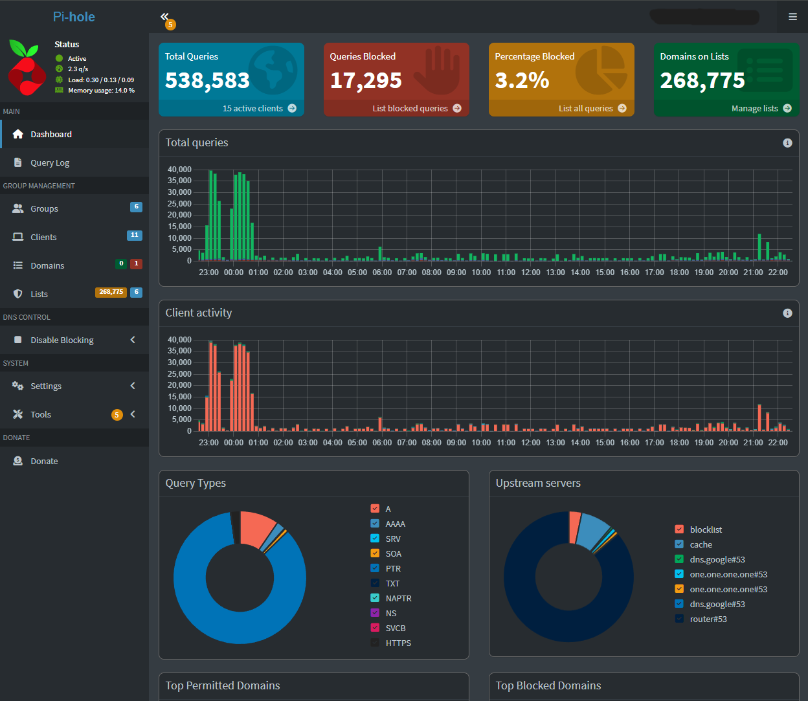
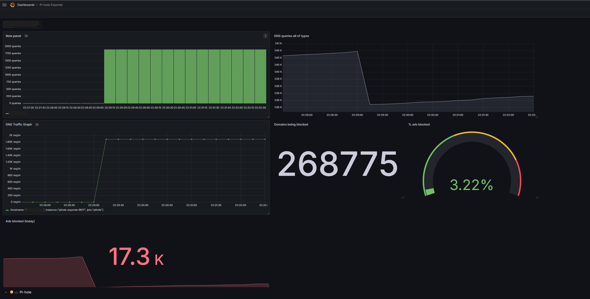
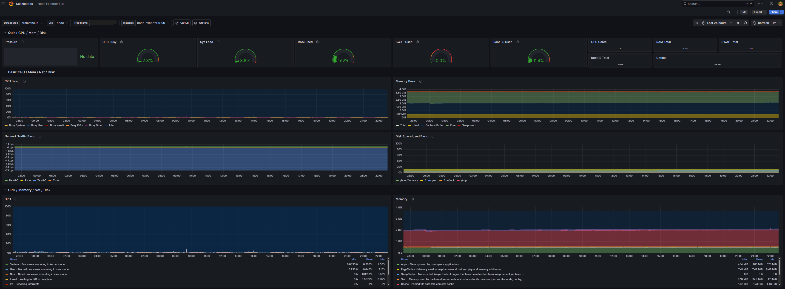
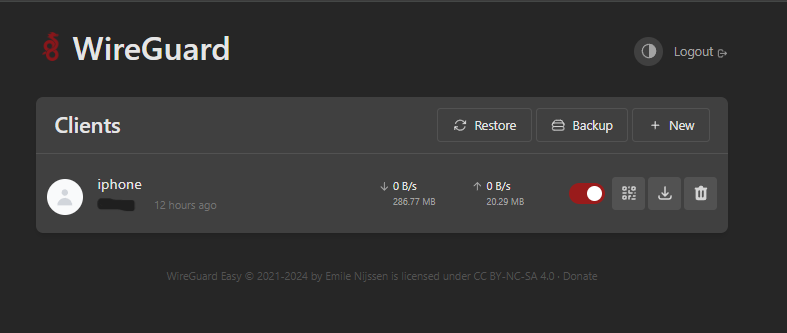
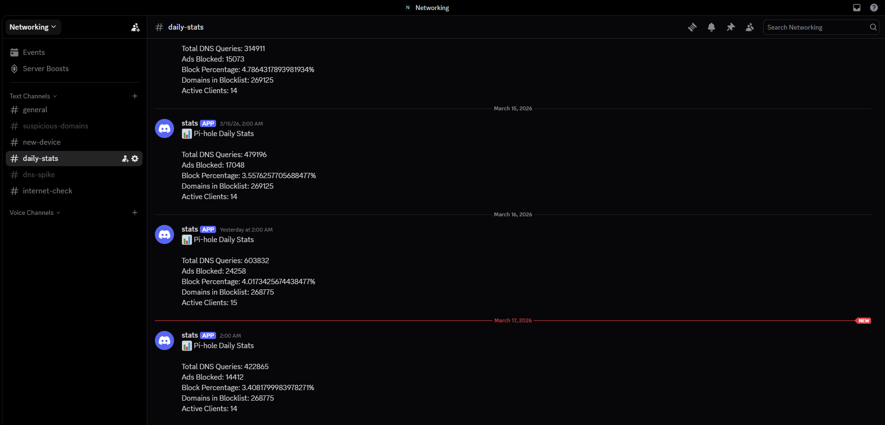
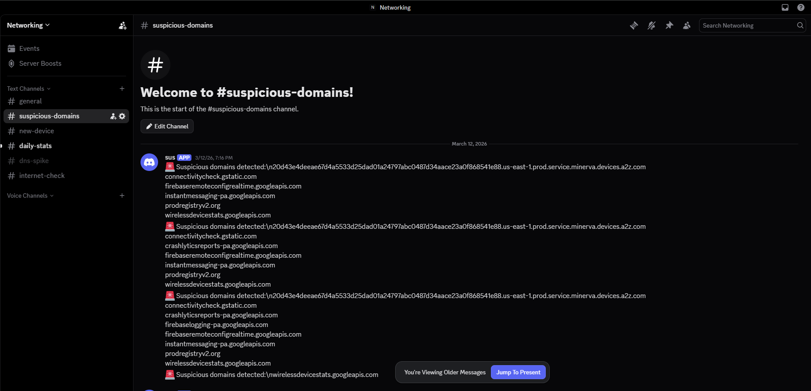
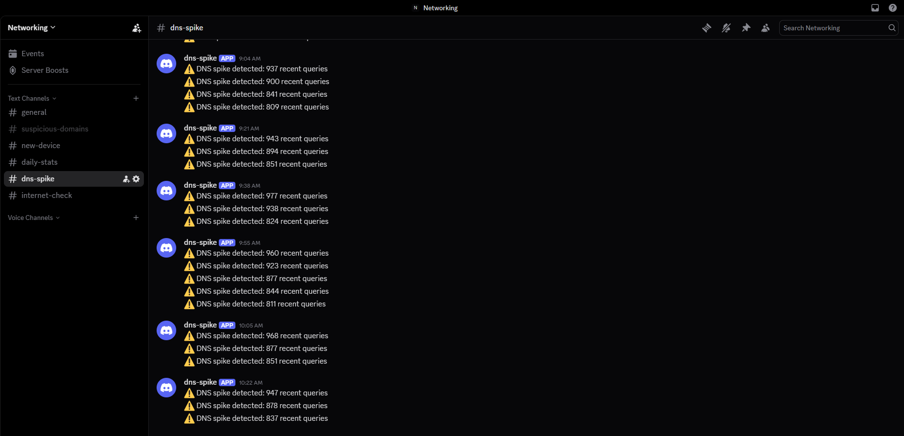
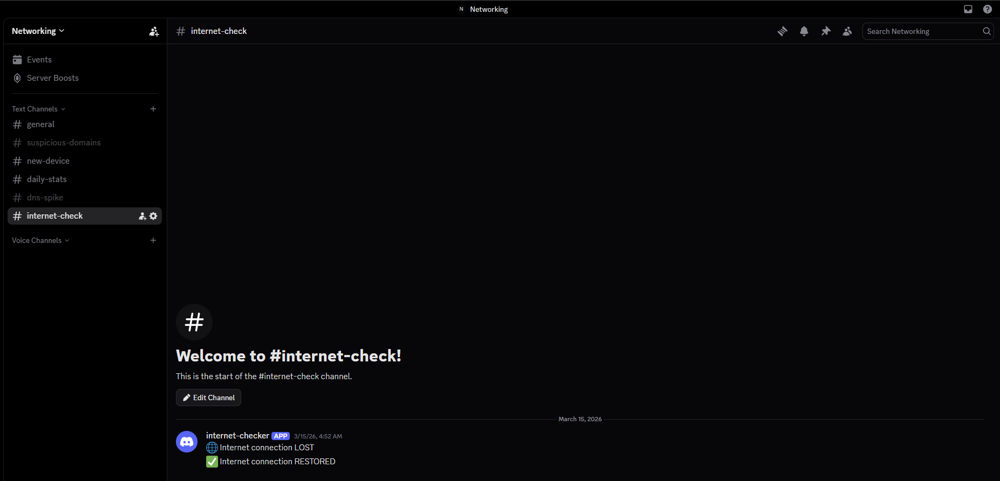

# Raspberry Pi Homelab – Network Monitoring & Security

Built a self-hosted Raspberry Pi 4 homelab to provide network-wide DNS filtering, monitoring dashboards, secure remote access, and automated alerting.

## Overview

This project documents my homelab environment used to monitor network traffic, block ads and malicious domains, visualize DNS activity, and send alerts for suspicious behavior or outages.

## Infrastructure

- Raspberry Pi 4
- Docker containers
- Pi-hole DNS sinkhole
- Grafana monitoring dashboards
- Prometheus exporters
- WireGuard VPN for remote access
- Discord webhook alerting

## Features

- Network-wide ad and malware blocking
- DNS query monitoring per device
- Real-time Grafana dashboards
- Automated Discord alerts for outages and suspicious DNS activity
- Secure remote access through WireGuard VPN

## Tech Stack

- Docker
- Linux
- Pi-hole
- Grafana
- Prometheus
- WireGuard
- Bash

## How It Works

1. Network clients send DNS requests through Pi-hole.
2. Pi-hole blocks ad, tracking, and malicious domains before they resolve.
3. Exporters collect DNS and system metrics from the homelab environment.
4. Grafana visualizes network activity, query trends, and hardware health.
5. Bash scripts send alerts to Discord for DNS spikes, suspicious activity, and connectivity issues.
6. WireGuard provides secure remote administrative access to internal services.

## Repository Structure
## Architecture

## Pi-Hole Dashboard

## Grafana Dashboards

### Network Monitor

### Hardware Monitor

## Wireguard VPN

### Accepted Devices

## Discord Alerts

### Daily Stats

### Suspicious Activity

### DNS Spikes

### Connection Check

